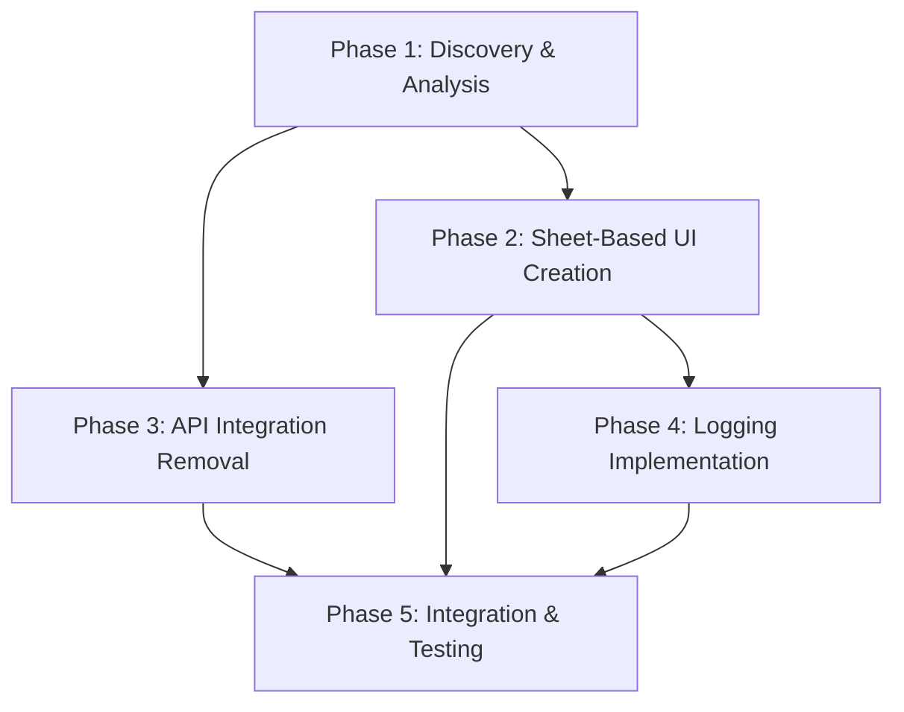

# Complete Implementation Plan – Camera Edit Feature Update

## Executive Summary

Planned the camera edit feature update using a comprehensive 5-phase approach:

- **Sheet-based editing** replaces inline editing
- **Camera update API calls** and service methods removed
- **JSON logging** replaces API functionality
- **Complete UI redesign** matching provided mockup

---

## Phase Structure & Dependencies



---

## Detailed Implementation Phases

### Phase 1: Discovery & Analysis

**Objective:** Understand current implementation structure

**Steps:**
1. Locate current camera detail/edit views  
   - Search `DahuaNVR/Features/Settings/Views/` directory  
   - Identify current edit functionality (inline vs separate)
2. Analyze camera data models  
   - Map existing fields to JSON logging structure  
   - Document required editable fields from mockup
3. Find `CameraAPIService` update methods  
   - Identify HTTP CGI endpoints for removal  
   - Document current API integration points

**Deliverables:**
- Current implementation documentation
- Camera data model field mapping
- API methods list for removal

---

### Phase 2: Sheet-Based Edit UI Creation

**Objective:** Create new sheet component matching design mockup

**Steps:**
4. Create `CameraEditSheet` component  
   - File: `DahuaNVR/Features/Settings/Views/CameraEditSheet.swift`  
   - Form fields: Channel, Manufacturer, IP, Port, Username, Password, etc.
5. Implement sheet presentation logic  
   - Add sheet state management to parent view  
   - Create edit button triggering sheet  
   - Add proper SwiftUI sheet modifiers
6. Add form validation and data binding  
   - Field validation (required fields, formats)  
   - Save/cancel button functionality  
   - Form state management

**Deliverables:**
- Complete `CameraEditSheet.swift` component
- Sheet presentation/dismissal functionality
- Form validation logic

---

### Phase 3: API Integration Removal

**Objective:** Remove camera update API functionality

**Steps:**
7. Remove camera update API methods  
   - Delete update functions from `CameraAPIService`  
   - Remove HTTP CGI update endpoints  
   - Clean up related networking code
8. Remove API calls from existing edit UI  
   - Remove API integration from current functionality  
   - Clean up loading states and error handling  
   - Remove success/failure handling logic

**Deliverables:**
- Cleaned `CameraAPIService`
- Removed API call integration
- Documentation of removed functionality

---

### Phase 4: Logging Implementation

**Objective:** Replace API calls with structured JSON logging

**Steps:**
9. Create JSON logging utility  
   - Camera data to JSON conversion  
   - Match exact JSON structure from requirements  
   - Proper formatting and encoding
10. Integrate logging into save action  
    - Replace API calls with logging in sheet  
    - Console/log output of JSON data  
    - Confirmation messaging

**Deliverables:**
- JSON logging utility function
- Integrated logging in save action
- Validated JSON format output

---

### Phase 5: Integration & Testing

**Objective:** Connect all components and validate functionality

**Steps:**
11. Connect components  
    - Replace inline editing with sheet presentation  
    - Test sheet lifecycle (open/close/save/cancel)  
    - Verify data flow between views
12. Final validation  
    - Test complete user flow  
    - Validate JSON output matches specification  
    - Confirm no API calls during save

**Deliverables:**
- Modified camera detail view
- Complete user flow testing
- JSON output validation report

---

## Technical Specifications

**Code Structure Example:**

```swift
struct CameraEditSheet: View {
    @Binding var camera: CameraModel
    @State private var editableCamera: CameraModel
    @Environment(\.dismiss) private var dismiss

    var body: some View {
        NavigationView {
            Form {
                // Field sections matching mockup
            }
            .navigationTitle("Edit Camera")
            .toolbar {
                // Save/Cancel buttons
            }
        }
    }
}
```

**Files to Modify:**
- New: `DahuaNVR/Features/Settings/Views/CameraEditSheet.swift`
- Modified: Camera detail view (location TBD in Phase 1)
- Modified: `DahuaNVR/Features/Settings/Services/CameraAPIService.swift`

**JSON Logging Format:**  
Must exactly match the provided structure with all camera fields included.

---

## Immediate Next Steps

**Step 1 – File Discovery (Start Now):**

```bash
# Search for camera-related views
find DahuaNVR -name "*.swift" -exec grep -l -i "camera.*edit\|edit.*camera" {} \;

# Locate camera detail views
find DahuaNVR/Features/Settings/Views -name "*.swift" -type f

# Find camera models
find DahuaNVR -name "*.swift" -exec grep -l -i "camera.*model\|camera.*struct" {} \;
```

**Step 2 – API Service Analysis:**
- Examine `DahuaNVR/Features/Settings/Services/CameraAPIService.swift`
- Document all update-related methods for removal
- Note HTTP endpoints handling camera configuration updates

**Step 3 – Data Model Mapping:**
- Analyze camera model structure
- Create field mapping to JSON requirements
- Validate all required fields from mockup are available

---

## Validation Checklist

- Edit button opens sheet (not inline editing)
- Sheet contains all fields from mockup image
- Save button logs JSON in exact specified format
- No API calls made during save operation
- Cancel/dismiss functionality works properly
- Existing camera detail view functionality preserved

---

## Success Criteria

- **User Flow:** Click edit → Sheet opens → Modify data → Click save → Console shows JSON log
- **Technical:** JSON structure exactly matches requirements, no network requests during save
- **UI:** Sheet design matches provided mockup exactly

---

**PLAN STATUS: COMPLETE AND READY FOR IMPLEMENTATION**

The development team can proceed immediately with the file discovery phase using the provided commands and systematic approach outlined above.
